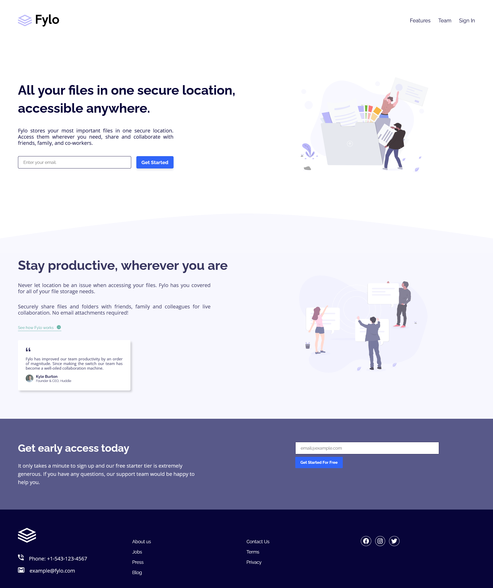

# Frontend Mentor - Huddle landing page with curved sections solution
  

This is a solution to the [Huddle landing page with curved sections challenge on Frontend Mentor](https://www.frontendmentor.io/challenges/fylo-landing-page-with-two-column-layout-5ca5ef041e82137ec91a50f5).

  

## Table of contents

  

- [Overview](#overview)

- [The challenge](#the-challenge)

- [Screenshot](#screenshot)

- [Links](#links)

- [My process](#my-process)

- [Built with](#built-with)

- [What I learned](#what-i-learned)

- [Author](#author)

  

## Overview

### The challenge

  

Users should be able to:

- View the optimal layout for the site depending on their device's screen size

  

### Screenshot

  

### Links

  

- Solution URL: [Repo:](https://github.com/Ibrahim-003/juniorProject__1)

- Live Site URL: [landing Page](https://ibrahim-003.github.io/juniorProject__1/)

  

## My process

### Built with

- Semantic HTML5 markup

- CSS custom properties

- Flexbox

- CSS Grid

- Mobile-first workflow

  

### What I learned

  

For this project the only new thing I have added is the use of GRID-CSS in the footer section.

  

## Author

  
- Ibrahim Almeyda

- Frontend Mentor - [@Ibrahim-003](https://www.frontendmentor.io/profile/Ibrahim-003)
  
